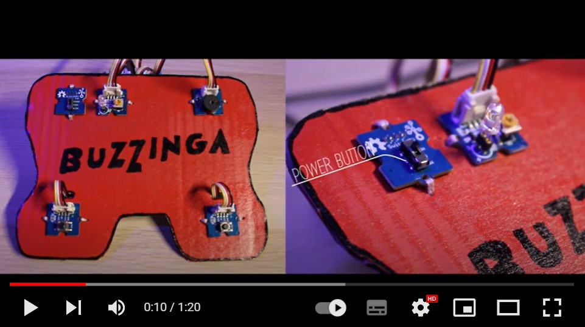

# About
Buzzinga is a rection game developed in Assembly on an ATmega328P.

The project was implemented as a student project in the elective Microcontroller Programming and was awarded with the symbolic Best Project Award.

Check out the gameplay in this YouTube clip:

